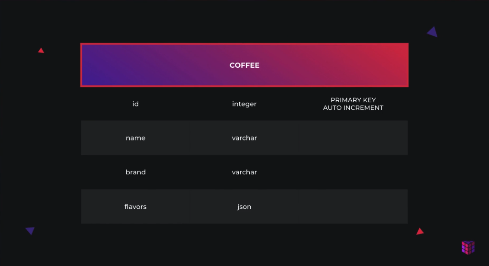
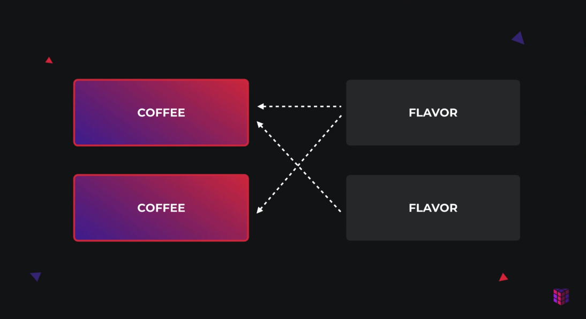
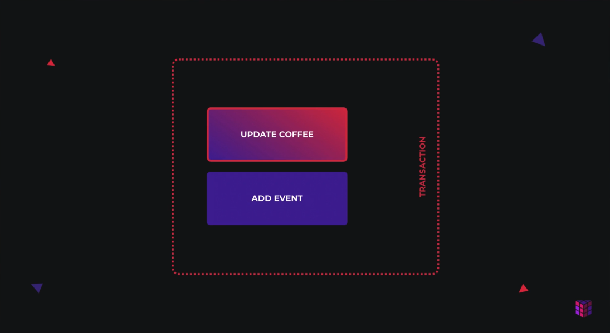

# iluvcoffee

## Notes

- `nest g co`
- `nest g co --no-spec`
- `nest generate controller modules/abc --dry-run`
- `nest g s`
- `nest g module coffees`
- `nest g class coffees/dto/create-coffee.dto --no-spec`
- `nest g class coffees/dto/update-coffee.dto --no-spec`

- `app.useGlobalPipes(new ValidationPipe());`
  - 各种 dto 的验证开启

```ts
app.useGlobalPipes(
  new ValidationPipe({
    whitelist: true,
    transform: true, // 开启 Payload 转换 Dto instance
    forbidNonWhitelisted: true, // 强制验证 dto 属性正确
  }),
);
```

### Autotransform Payloads to DTO instances

- `npm i @nestjs/mapped-types`
  - `console.log(createCoffeeDto instanceof CreateCoffeeDto);`
  - 还能在控制器中任意转换查询参数

### databse

```yml
version: '3'

services:
  db:
    image: postgres:12
    restart: always
    ports:
      - '5432:5432'
    environment:
      POSTGRES_PASSWORD: pass123
```

- `npm i @nestjs/typeorm typeorm pg`

```ts
// -------- app.module.ts
import {
  // -------- /src/coffees/entities/coffee.entity.ts
  // 算是一种绑定吧 TypeOrmModule 的 autoLoadEntities 可以识别
  Entity,
} from 'typeorm';

@Entity('coffees') // ! -> sql table === 'coffees'
export class Coffee {
  @PrimaryGeneratedColumn()
  id: number;

  @Column()
  name: string;

  @Column()
  brand: string;

  @Column('json', { nullable: true })
  flavors: string[];
}
```



### Create a Relation between two Entities



- `nest g class coffees/entities/flavor.entity --no-spec`

- 在 N 张表级联时，手动在服务层 find\* 的函数中添加级联参数: `relations: ['flavors']`
- model 层增加参数: `{ cascade: true }`  为了插入时用

### pagination

- `nest g class common/dto/pagination-query.dto --no-spec`
- offset 不传时就是 0 ，不要纠结 0 不是实数的问题

```ts
export class PaginationQueryDto {
  @IsOptional()
  @IsPositive()
  limit: number;

  @IsOptional()
  @IsPositive()
  offset: number;
}
```

> `nestjs` 还真有点艺术感

### Transactions



- `nest g class events/entities/event.entity --no-spec`

```ts
async recommendCoffee(coffee: Coffee) {
  const queryRunner = this.connection.createQueryRunner();

  await queryRunner.connect();
  await queryRunner.startTransaction();

  try {
    coffee.recommendations++;

    const recommendEvent = new Event();
    recommendEvent.name = 'recommend_coffee';
    recommendEvent.type = 'coffee';
    recommendEvent.payload = { coffeeId: coffee.id };

    await queryRunner.manager.save(coffee);
    await queryRunner.manager.save(recommendEvent);

    await queryRunner.commitTransaction();
  } catch (err) {
    await queryRunner.rollbackTransaction();
  } finally {
    await queryRunner.release();
  }
}
```

### Indexes

```ts
@Index(['name', 'type'])
@Entity()
export class Event {
  @PrimaryGeneratedColumn()
  id: number;

  @Column()
  type: string;

  @Index()
  @Column()
  name: string;

  @Column('json')
  payload: Record<string, any>;
}
```

### Magrations

```js
module.exports = {
  type: 'postgres',
  host: 'localhost',
  port: 5432,
  username: 'postgres',
  password: 'pass123',
  database: 'postgres',
  entities: ['dist/**/*.entity.js'],
  migrations: ['dist/migrations/*.js'],
  cli: {
    migrationsDir: 'src/migrations',
  },
};
```

- 当新增、删除字段是则可以全自动处理
  - 修改 entity 模型
  - 删除 ./dist 文件夹
  - 运行 `nest build`
  - 执行 `npx typeorm migration:generate -n SchemaSync` 生成脚本
  - 执行 `npx typeorm migration:run` 提交 commits

- 当修改表字段的名称时需要特别处理
  - `npx typeorm migration:create -n CoffeeRefactor`
  - 执行修改 `refactor` 脚本
  - 删除 ./dist 文件夹
  - 运行 `nest build`
  - 执行 `npx typeorm migration:generate -n SchemaSync` 生成脚本
  - 执行 `npx typeorm migration:run` 提交 commits

```ts
export class CoffeeRefactor1598261655449 implements MigrationInterface {
  public async up(queryRunner: QueryRunner): Promise<void> {
    await queryRunner.query(
      `ALTER TABLE "coffee" RENAME COLUMN "name" TO "title"`,
    );
  }

  public async down(queryRunner: QueryRunner): Promise<void> {
    await queryRunner.query(
      `ALTER TABLE "coffee" RENAME COLUMN "title" TO "name"`,
    );
  }
}
```

> 真不好监测字段名称变化，只能自己手动处理。

### Dependency Injection
